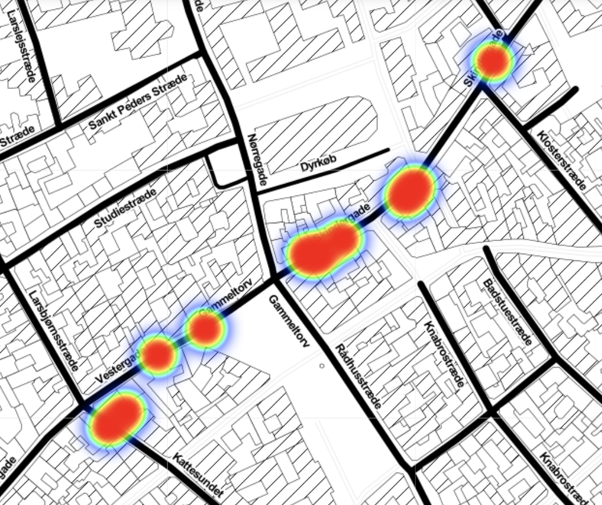
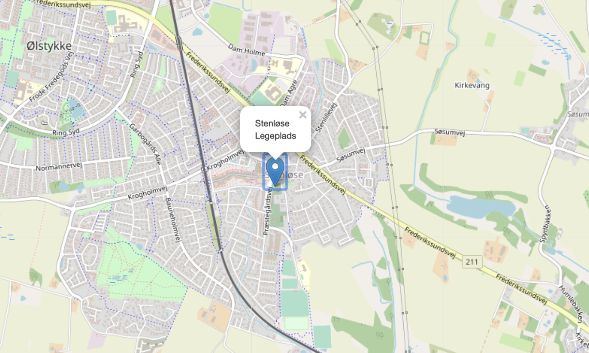

## Welcome to the life of an average Eel from Stenløse

The [Eel](https://en.wikipedia.org/wiki/Eel) is a ray-finned fish belonging to the order Anguilliformes, which consists of eight suborders, 19 families, 111 genera, and about 800 species. It is most commonly found around a small town on Sjælland called [Stenløse](https://da.wikipedia.org/wiki/Stenl%C3%B8se), where it is most often spotted at the local playground. During the mating season however, it is known for moving more east of Sjælland, and is to be found around Skindergade and Kattesundet, where it haunts its prey.

### Early life of an average Eel

The early life of the Eel is to this day unclear. The first record of the eel however is documented is this foto, taken right after he saved the life of 50 people at an age of 12 years:

### First love 
He has always been a ladys man. Here he is pictured with his first girlfriend:

### Mating season

The mating season of the Eel takes place in central Copenhagen, around Skindergade and Kattesundet. Here the Eel will slime op and down the area, hunting for hopeless pray.

Heat map illustrating the Eels movement: 

### Favourite Location 
The eel is known for its love towards Stenløse playground, where it can often be found between 4am and 7 am during weekends. This is known to the locals in Stenløse, who make sure to keep their kids safe and far away from the playground at these hours.

